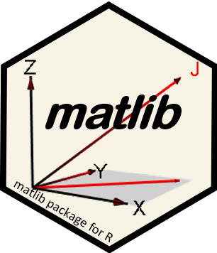

<!-- badges: start -->

<!--  -->

<!-- badges: end -->

# matlib 

**Matrix Functions for Teaching and Learning Linear Algebra and Multivariate Statistics**, http://friendly.github.io/matlib/

Version 1.0.1

These functions were originally designed for tutorial purposes in teaching & learning matrix algebra
ideas using R. In some cases, functions are provided for concepts or computations available
elsewhere in R, but where the name is not obvious, e.g., `R()` for the rank of a matrix,
or `tr()` for matrix trace.

In other
cases, we provide cover functions to show or demonstrate an algorithm in more detail, sometimes
providing a `verbose =` argument to print the details of computations, e.g., `Det()` for a
matrix determinant, `Inverse()` for a matrix inverse, using `gaussianElimination()` to show the
steps.

In addition, a collection of functions are provided for drawing vector diagrams in 2D and 3D, illustrating
various concepts of linear algebra more concretely than has been available before.
For example, 

* `showEqn(A, b)` shows the matrix equations $\mathbf{A x} = \mathbf{b}$ in text or LaTeX form, while
`plotEqn(A, b)` and `plotEqn3d(A, b)` plots those equations in 2D or 3D space.

* `matrix2latex()`, `latexMatrix()`, `Eqn()` and friends facilitate writing matrix equations in LaTeX.

* `vectors()`, `vectors3d()` plot geometric vector diagrams in 2D or 3D, with other functions to draw
angles and arcs.

* `regvec3d()` calculates and plot vectors representing a bivariate regression model, `lm(y ~ x1 + x2)`

## Installation

Get the released version from CRAN:

     install.packages("matlib")

Or the development version from my [R-universe](https://friendly.r-universe.dev):

    install.packages('matlib', repos = c('https://friendly.r-universe.dev', 'https://cloud.r-project.org'))

The development version can also be installed to your R library directly from this repo via:

     if (!require(remotes)) install.packages("remotes")
     remotes::install_github("friendly/matlib", build_vignettes = TRUE)

The functions that draw 3D graphs use the **rgl** package. On macOS, **rgl** requires that [XQuartz](https://www.xquartz.org/) be installed. After installing XQuartz, it's necessary either to log out of and back into your macOS account or to reboot your Mac.

## Topics
The functions in this package are grouped under the following topics

1. **Convenience functions**:  

  - `tr()` - trace of a matrix
  - `R()` - rank of a matrix
  - `J()` - constant vector, matrix or array
  - `len()` - Euclidean length of a vector or columns of a matrix
  - `vec()` - vectorize a matrix
  - `Proj(y, X)` - projection of vector y on columns of matrix **X**
  - `mpower(A, p)` - matrix powers for a square symmetric matrix
  - `xprod(...)` - vector cross-product

2. **Determinants**: functions for calculating determinants by cofactor expansion

  - `minor()` - Minor of A[i,j]
  - `cofactor()` - Cofactor of A[i,j]
  - `rowMinors()` - Row minors of A[i,]
  - `rowCofactors()` - Row cofactors of A[i,]
  - `Det()` - Determinants by elimination or eigenvalues

3. **Elementary row operations**: functions for solving linear equations "manually" by the steps used in row echelon form and Gaussian elimination

  - `rowadd()` - Add multiples of rows to other rows
  - `rowmult()` - Multiply rows by constants
  - `rowswap()` - Interchange two rows of a matrix

4. **Linear equations**: functions to illustrate linear equations of the form $\mathbf{A x = b}$

  - `showEqn(A, b)` - show matrices (A, b) as linear equations, as text or in LaTeX
  - `plotEqn(A, b)`, `plotEqn3d(A, b)`  - plot matrices (A, b) as linear equations
  
5. **Gaussian elimination**: functions for illustrating Gaussian elimination for solving systems of linear equations of the form
$\mathbf{A x = b}$.  These functions provide a `verbose=TRUE` argument to show the intermediate steps
and a `fractions=TRUE` argument to show results using `MASS::fractions()`.

  - `gaussianElimination(A, B)` - reduces $(A, B)$ to $(I, A^{-1} B)$
  - `Inverse(X)`, `inv()` - uses `gaussianElimination` to find the inverse of X, $\mathbf{X}^{-1}$
  - `echelon(X)` - uses `gaussianElimination` to find the reduced echelon form of X
  - `Ginv(X)` - uses `gaussianElimination` to find the generalized inverse of X
  - `LU(X)` - LU decomposition of a matrix X
  - `cholesky(X)` - calculates a Cholesky square root of a matrix
  - `swp()` - matrix sweep operator

6. **Eigenvalues**: functions to illustrate the algorithms for calculating eigenvalues and eigenvectors and related matrix decompositions and generalizations.

  - `Eigen()` - eigenvalues and eigenvectors
  - `SVD()` - singular value decomposition, \$mathbf{X = U D V}$
  - `powerMethod()` - find the dominant eigenvector using the power method 
  - `showEig()` - draw eigenvectors on a 2D scatterplot with a dataEllipse
  - `MoorePenrose()` - illustrates how the Moore-Penrose inverse can be calculated using `SVD()`

7. **Vector diagrams**: functions for drawing vector diagrams in 2D and 3D

  - `arrows3d()` - draw nice 3D arrows
  - `corner()`, `arc()` -  draw a corner or arc showing the angle between two vectors in 2D/3D
  - `pointOnLine()` - position of a point along a line
  - `vectors()`, `vectors3d()` - plot geometric vector diagrams in 2D/3D 
  - `regvec3d()` - calculate and plot vectors representing a bivariate regression model, `lm(y ~ x1 + x2)` in mean-deviation form.

8. **Matrix equations in LaTeX** 
  - `matrix2latex()`: Convert matrix to LaTeX equation
  - `latexMatrix()`: Create and manipulate LaTeX representations of matrices
  - `latexMatrixOperations`: Matrix operators (e.g., `%*%`, `%O%`) and functions (`matmult()`, `kronecker()`) for matrix arithmetic, but rendered in LaTeX
  - `Eqn()`: A wrapper for equations composed from `latexMatrix()` expressions and LaTeX text, with ability to preview the results in a Viewer pane.

### Vignettes and presentations

A small collection of vignettes is now available.  Use `browseVignettes("matlib")` to explore them.

| Vignette                                                                                  | Title                                                 |
|-------------------------------------------------------------------------------------------|-----------------------------------------------        |
| [a1-det-ex1](http://friendly.github.io/matlib/articles/a1-det-ex1.html)                   | Properties of determinants                            |
| [a2-det-ex2](http://friendly.github.io/matlib/articles/a2-det-ex2.html)                   | Evaluation of determinants                            |
| [a3-inv-ex1](http://friendly.github.io/matlib/articles/a3-inv-ex1.html)                   | Inverse of a matrix                                   |
| [a4-inv-ex2](http://friendly.github.io/matlib/articles/a4-inv-ex2.html)                   | Matrix inversion by elementary row operations         |
| [a5-ginv](http://friendly.github.io/matlib/articles/a5-ginv.html)                         | Generalized inverse                                   |
| [a6-inv-3d](http://friendly.github.io/matlib/articles/a6-inv-3d.html)                     | Linear transformations and matrix inverse in 3D   |
| [a7-eigen-ex1](http://friendly.github.io/matlib/articles/a7-eigen-ex1.html)               | Eigenvalues and Eigenvectors: Properties              |
| [a8-eigen-ex2](http://friendly.github.io/matlib/articles/a8-eigen-ex2.html)               | Eigenvalues: Spectral Decomposition                   |
| [a9-linear-equations](http://friendly.github.io/matlib/articles/a9-linear-equations.html) | Solving Linear Equations                              |
| [aA-gramreg](http://friendly.github.io/matlib/articles/aA-gramreg.html)                   | Gram-Schmidt Orthogonalization and Regression         |
| [aB-data-beta](http://friendly.github.io/matlib/articles/aB-data-beta.html)               | Vector Spaces of Least Squares and Linear Equations   |
| [latex-equations](http://friendly.github.io/matlib/articles/latex-equations.html)   | LaTeX Equations with latexMatrix, Eqn and matrix2latex|

See also: 

* Fox & Friendly, [_Visualizing Simultaneous Linear Equations, Geometric Vectors, and Least-Squares Regression with the matlib Package for R_](https://facsocsci.mcmaster.ca/jfox/Papers/matlib-useR2016.pdf).
June 2016, useR! Conference, Stanford.

<!-- (https://socialsciences.mcmaster.ca/jfox/Papers/matlib-useR2016.pdf), -->

* Ivan Savov, [Linear algebra explained in four pages](https://souravsengupta.com/cds2016/lectures/Savov_Notes.pdf)

