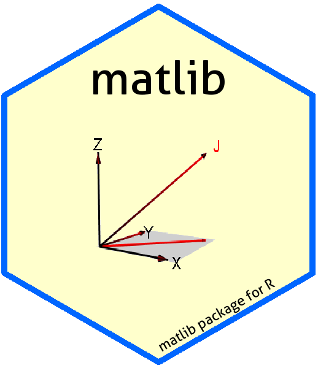

# matlib 

**Matrix Functions for Teaching and Learning Linear Algebra and Multivariate Statistics**, http://friendly.github.io/matlib/

Version 0.9.3

These functions are mainly for tutorial purposes in teaching & learning matrix algebra
ideas using R. In some cases, functions are provided for concepts or computations available
elsewhere in R, but where the name is not obvious.  In other
cases, we provide cover functions to show or demonstrate an algorithm in more detailsometimes
providing a `verbose =` argument to print the details of computations.

In addition, a collection of functions are provided for drawing vector diagrams in 2D and 3D, illustrating
various concepts of linear algebra more concretely than has been available before.

## Installation

Get the released version from CRAN:

     install.packages("matlib")

The development version can be installed to your R library directly from this repo via:

     if (!require(devtools)) install.packages("devtools")
     library(devtools)
     install_github("friendly/matlib", build_vignettes = TRUE)

This installs the package from the source and creates the package vignettes, 
so you will need to have R Tools installed on your system.  [R Tools for Windows](https://cran.r-project.org/bin/windows/Rtools/)
takes you to the download page for Windows.  [R Tools for Mac OS X](https://cran.r-project.org/bin/macosx/tools/)
has the required programs for Mac OS X.

## Topics
The functions in this package are grouped under the following topics

1. Convenience functions:  

  - `tr()` - trace of a matrix
  - `R()` - rank of a matrix
  - `J()` - constant vector, matrix or array
  - `len()` - Euclidean length of a vector or columns of a matrix
  - `vec()` - vectorize a matrix
  - `Proj(y, X)` - projection of vector y on columns of X
  - `mpower(A, p)` - matrix powers for a square symmetric matrix

2. Determinants: functions for calculating determinants by cofactor expansion

  - `minor()` - Minor of A[i,j]
  - `cofactor()` - Cofactor of A[i,j]
  - `rowMinors()` - Row minors of A[i,]
  - `rowCofactors()` - Row cofactors of A[i,]
  - `Det()` - Determinants by elimination or eigenvalues

3. Elementary row operations: functions for solving linear equations "manually" by the steps used in row echelon form and Gaussian elimination

  - `rowadd()` - Add multiples of rows to other rows
  - `rowmult()` - Multiply rows by constants
  - `rowswap()` - Interchange two rows of a matrix

4. Linear equations: functions to illustrate linear equations of the form $\mathbf{A x = b}$

  - `showEqn(A, b)` - show matrices (A, b) as linear equations
  - `plotEqn(A, b)`, `plotEqn3d(A, b)`  - plot matrices (A, b) as linear equations
  
5. Gaussian elimination: functions for illustrating Gaussian elimination for solving systems of linear equations of the form
$\mathbf{A x = b}$.  These functions provide a `verbose=TRUE` argument to show the intermediate steps
and a `fractions=TRUE` argument to show results using `MASS::fractions`.

  - `gaussianElimination(A, B)` - reduces (A, B) to (I, A^{-1} B)
  - `Inverse(X)`, `inv()` - uses `gaussianElimination` to find the inverse of X
  - `echelon(X)` - uses `gaussianElimination` to find the reduced echelon form of X
  - `Ginv(X)` - uses `gaussianElimination` to find the generalized inverse of X
  - `LU(X)` - LU decomposition of a matrix X
  - `cholesky()` - calculates a Cholesky square root of a matrix
  - `swp()` - matrix sweep operator

6. Eigenvalues: functions to illustrate the algorithms for calculating eigenvalues and eigenvectors and related matrix decompositions and generalizations.

  - `Eigen()` - eigenvalues and eigenvectors
  - `SVD()` - singular value decomposition
  - `powerMethod()` - find the dominant eigenvector using the power method 
  - `showEig()` - draw eigenvectors on a 2D scatterplot with a dataEllipse
  - `MoorePenrose()` - illustrates how the Moore-Penrose inverse can be calculated using `SVD()`

7. Vector diagrams: functions for drawing vector diagrams in 2D and 3D

  - `arrows3d()` - draw nice 3D arrows
  - `corner()`, `arc()` -  draw a corner or arc showing the angle between two vectors in 2D/3D
  - `pointOnLine()` - position of a point along a line
  - `vectors()`, `vectors3d()` - plot geometric vector diagrams in 2D/3D 
  - `regvec3d()` - calculate and plot vectors representing a bivariate regression model, `lm(y ~ x1 + x2)` in mean-deviation form.

### Vignettes and presentations

A small collection of vignettes is now available.  Use `browseVignettes("matlib")` to see them.

| Vignette                                                                            | Title                                         |
|-------------------------------------------------------------------------------------|-----------------------------------------------|
| [det-ex1](http://friendly.github.io/matlib/articles/det-ex1.html)                   | Properties of determinants                    |
| [det-ex2](http://friendly.github.io/matlib/articles/det-ex2.html)                   | Evaluation of determinants                    |
| [inv-ex1](http://friendly.github.io/matlib/articles/inv-ex1.html)                   | Inverse of a matrix                           |
| [inv-ex2](http://friendly.github.io/matlib/articles/inv-ex2.html)                   | Matrix inversion by elementary row operations |
| [ginv](http://friendly.github.io/matlib/articles/ginv.html)                         | Generalized inverse                           |
| [eigen-ex1](http://friendly.github.io/matlib/articles/eigen-ex1.html)              | Eigenvalues and Eigenvectors: Properties      |
| [eigen-ex2](http://friendly.github.io/matlib/articles/eigen-ex2.html)               | Eigenvalues: Spectral Decomposition           |
| [linear-equations](http://friendly.github.io/matlib/articles/linear-equations.html) | Solving Linear Equations                      |
| [gramreg](http://friendly.github.io/matlib/articles/gramreg.html)                   | Gram-Schmidt Orthogonalization and Regression |

See also: Fox & Friendly, [_Visualizing Simultaneous Linear Equations, Geometric Vectors, and Least-Squares Regression with the matlib Package for R_](https://socialsciences.mcmaster.ca/jfox/Papers/matlib-useR2016.pdf),
June 2016, useR! Conference, Stanford.

